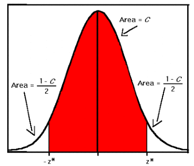
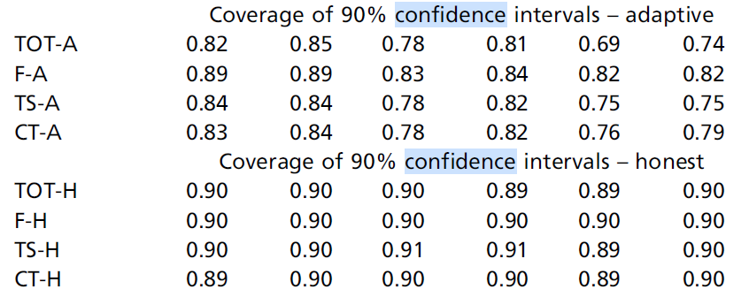
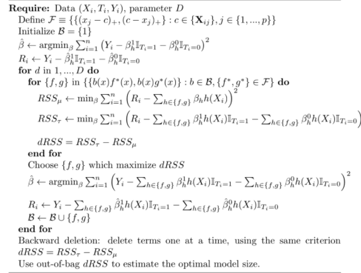

```{r setup, include=FALSE}
knitr::opts_chunk$set(echo = TRUE)
```

```{r eval=FALSE, include=FALSE}
##some new idea about the models
# S-learner
# T-learner<this is we used for our presentation>
# X-learner
# combine with RF

# simulation cases
#   1. different dimension 10,20
#   2. linear
#   3. numeric
#   4. classification
#   5. combination above
# 
# sample:
#   1.equal sample sized across treatment and control
#   2.unequal sample sized across treatment and control (unbalance cases)
#   3.extreme cases : The cart equals to 1 or 0 <there is nothing to know from observed variables>
#   
# R library
#   grf
#   earth
#   
# plot 
# 1.the accuracy among different sample size
# 2.the accuracy among different models
# 3.compare three simulation cases among different models
# 
# table
# 1. the coverage of 95% CI
# 2. the MSE
# 3. the width of the CI (use the upper and lower boundary minus the true tau and get a average among all the data set.  Or just upper minus lower bondary to see the width of the CI.)(the mean & median)

```

```{r include=FALSE}
if(!require("rlang")) install.packages("rlang")
library("rlang")

if(!require("dplyr")) install.packages("dplyr")
library(dplyr)

if(!require("data.table")) install.packages("data.table")
library(data.table)
```

# 1. Introduction

  Supervised machine learning (ML) techniques excel at predicting outcomes as a function of covariates. As ML techniques for prediction become increasingly more advanced, practitioners have begun applying ML techniques to problems typically addressed with conventional statistical techniques. One such example is using predictive ML algorithms to estimate causal heterogeneous treatment effects. Though ML algorithms are able to have strong predictive capabilities, the algorithms' statistical properties - which are important to infer causation - are largely unknown [1]. Accordingly, they are an active theoretical and empirical research topic [1-5]. In many situations where treatment effects are estimated, the ability to estimate confidence intervals for the treatment effect is vital. Further, if confidence intervals are to be used reliably for statistical inference, it is important to understand their statistical properties. In this paper we identify ML prediction techniques that have been studied in the context of estimating heterogeneous treatment effects and their confidence intervals. We review four ML models that have been studied for estimating heterogeneous treatment effects and constructing corresponding confidence intervals, and using the R programming language we simulate four different data sets with a true treatment effect, an observed treatment effect, and covariates. We then train the four models on the four data sets and generate observation-level estimates for the treatment effect and the variance. We then calculate several statistics to enable us to compare the accuracy of treatment effect and the coverage of confidence interval estimates. Finally, we summarize the current state of research and suggest areas for further study.

## Motivating Example 

One of the most promising applications for heterogenous treatment effect estimation is medical research. Randomized control trials (RCT) for studying potential new medications are constrained by cost, time, and other factors, with clinical studies costing tens of thousands of Euros per patient and following patients for up to six years. Therefore, sample sizes for clinical studies are chosen based on power calculations designed to demonstrate that the average treatment effect in the treatment group is convincingly superior to the placebo group. In medical research there are many covariates for every observation, and it is possible to consider many different sub-groups of the study population. Even when sub-groups exhibit statistically significant treatment effects that are superior to the average treatment effect, it is difficult to separate a truly heterogenous treatment effect from spurious correlation. Said another way, when searching over many different subgroups, one is bound to find statistically significant estimated heterogeneous treatment effects, though this may or may not be a truly heterogenous treatment effect. However, currently, the tools to confidently determine whether a subgroup’s estimated treatment effect truly differs from the estimated average treatment effect of the study population are not well developed.

To provide a real-life scenario for context, imagine a biotechnology company that is developing a new drug to treat heart disease. The company is reviewing the results of their recently completed clinical trial, and they are using the findings from the completed trial to inform the design their upcoming final clinical trial. The goal of the final trial is to prove to the European regulatory authorities that their drug reduces heart disease. When designing the final trial, the company has to consider that if their trial is successful and their drug is approved by the regulatory authorities, only people who meet the same criteria as the patients who were studied in the final clinical trial are eligible to take the medicine. Thus, the broader the criteria, the more eligible patients there are, which can lead to a larger market size.

However, broader criteria for selecting patients typically means including patients who have a lower probability of benefiting from the drug, or who have certain characteristics that will make it harder to observe the treatment effect of the drug, i.e. a higher treatment effect variance. When broadening the patient selection criteria leads to an overall weaker and more variable treatment effect, the company faces several risks. First, with the resulting higher treatment effect variance and/or lower average treatment effect, the company risks that the clinical study does not meet the pre-specified criteria to show that the drug is effective. If the clinical trial fails, it does not matter how big or small the market is, because the drug will not be allowed to be prescribed by doctors. Secondly, even if the drug is proven to be efficacious, with a higher variance and/or lower average treatment effect, the company risks only being able to demonstrate relatively weak efficacy (when compared to relatively strong efficacy for a study population that is smaller and more precise). There are several potential consequences for this result. First, the drug with weaker efficacy evidence can command a relatively lower price, as the health economic benefit – which is often the basis for a drug’s price - is relatively lower. Or, with relatively lower proven efficacy, doctors are not as likely to prescribe the drug to patients, given that all drugs have negative side effects that must be weighed against the drug’s positive efficacy.

To return to the specific scenario of the biotechnology company studying heart disease, in their recently completed clinical trial, the company noticed that a sub-group of patients, those with diabetes, had an average treatment effect that was twice as good as the general population that was studied in the trial. When running the statistics, the treatment effect of the diabetic sub-group was statistically significant with a 95% level of confidence. However, the 95% confidence interval overlaps with average treatment effect of the general population, meaning that the company is not so sure whether the treatment effect for the diabetic patients is truly superior to the general population, or just spurious correlation that resulted from analyzing many subgroups after the study was completed. 

The diabetic patient sub-group represented 40% of the total patients studied in the group. When designing their final trial, the company has to decide whether to keep the same criteria for selecting patients as they had in their recently completed study, or change the criteria to only include the 40% of patients who are diabetic. If the diabetic patients truly have a treatment effect that is twice as good as the general study population, the drug would be much more valuable, and command a higher price. Unfortunately, the company has no real way to know whether the drug is truly more efficacious for the diabetic subgroup. This is a problem faced by many researchers, and currently the tools to safely conduct post-hoc sub-group analyses are lacking. 


# 2. Challenges for Heterogeneous Treatment Effect and Confidence Interval Estimation

For this project we identified three primary problems with estimating heterogeneous treatment effects and generating corresponding confidence intervals.


## 2.1 The fundamental problem of causal inference

One fundamental difference between making predictions and estimating treatment effects, which has been referred to as the "fundamental problem of causal inference”, is that the true treatment effect cannot be known [6]. Methods such as randomized controlled trials (RCTs), in which a control group receives placebo and a treatment group receives the treatment, aim to infer treatment effect through randomization. However, for an individual who receives treatment, one can never know what would have happened to that individual if they had received placebo, and vice versa.

## 2.2 Post-hoc subgroup analysis

A second problem, specifically for estimating heterogeneous treatment effects, is post-hoc sub-group analysis. This problem is evident from our earlier motivating example. Imagine conducting a clinical trial with 1000 patients to study a potential new medicine, with 500 patients receiving placebo, and 500 patients receiving the drug. Each patient has many background characteristics such as age, race, sex, pre-existing medical conditions, concomitant medications, income, etc. Additionally, there are thousands of possible laboratory and other medical tests that can be covariates. As such, one can imagine that there are almost limitless opportunities to create sub-groups. Using traditional techniques, with the customary p-value of 0.05, one can imagine that roughly 1:20 sub-groups that do not have a truly heterogenous treatment effect be a false positive. Further, there is no way to distinguish between false positives and false negatives. Thus, post-hoc data analysis is often viewed with skepticism, and rightfully so. In medical studies, current practice is to specify sub-groups based on medical intuition prior to the start of the trial, and then to treat any post-hoc sub-group analysis with caution. Ideally, there would be a way to conduct post-hoc analysis on sub-groups that would minimize the risk of false positives. This challenge is well summarized in a 2017 paper published by two researchers at Stanford University:

"An impediment to exploring heterogeneous treatment effects is the fear that researchers will iteratively search for subgroups with high treatment levels, and then report only the results for subgroups with extreme effects, thus highlighting heterogeneity that may be purely spurious" [7] [8]

## 2.3 Lack of CI functionality

Finally, a third problem is that many ML prediction algorithms are not designed to estimate confidence intervals. This problem is due to the fact the algorithms are being repurposed from their original intended use for prediction. Thus, for some algorithms, it is not easy to see how generating confidence intervals would be possible.


# 3. Statistical Background

Before discussing specific models, it is important to cover the statistical underpinnings of estimating treatment effects. Though the pace of machine learning algorithm development and their contribution to and dominance across a variety of disciplines has been astounding, one drawback to their application to estimating treatment effects is the lack knowledge about the algorithms' statistical properties. If algorithms are to be applied in treatment effect estimation situations, statistical inference is often vital.

In this context there are three fundamental properties of estimators of parameters that we will discuss: distribution, consistency, and unbiasedness. Further, we will discuss these estimators with respect to two parameters: the estimation of the treatment effect, and the estimate of the confidence interval, which is a function of the estimate of the variance. Without these the properties, confidence intervals cannot be reliably established [5].

In frequentist statistics, an estimator of a true parameter from a sample can be seen as one of many estimates of a true parameter. In most applications the true parameter values are never known, and can only be approximated with estimates. When estimating a true parameter, for example the treatment effect for the population of patients with heart disease, we can imagine running many different clinical trials, each time sampling from the patient population of people with heart disease. After each clinical trial we estimate the treatment effect. Because each sample that we take from the heart disease patient population is different, our estimates of the true treatment effect are different for every clinical trial. These estimates of the true treatment effect form their own distribution. For example, if one were to run 1000 clinical trials with different samples of patients with heart disease, there would be 1000 different estimates for the treatment effect and for the treatment effect variance. One can imagine plotting these 1000 estimates and visualizing the resulting distribution. Further, one can ask whether these 1000 estimates seem to be converging on a specific value, and what happens in theory when we run infinitely many experiments.

As stated earlier, because we are constrained by time, funding, and other resources, we do not have the luxury of running infinitely, or even multiple, different experiments. Thus, the goal is to use statistics to understand the properties of the estimators as if we were able to run infinitely many experiments. If we understand these properties, we can confidently apply the properties after running only one experiment.

In practice, these properties can be elucidated from theoretical or empirical research. Again, for our purposes, we are interested in the properties of estimators for the treatment effect for different sub-groups, and the estimator for the treatment effect variance.

## 3.1 Normal, Gaussian Distribution

The first property that we are concerned with is the distribution of the estimators. Many statistical properties rely upon an estimator having a normal distribution; thus this is truly a foundational property. The normal distribution can be seen in many natural phenomena, such as person height, and is colloquially referred to as the “bell curve”. The normal distribution is an important part of the central limit theorem, and it defines the shape of the distribution of a random variable, which in our case is the estimated treatment effect and the estimated treatment effect variance.

## 3.2 Unbiasedness

Unbiasedness tells us that if we were to draw infinitely many samples of the heart disease population and calculate an estimated treatment effect for each sample, the average of all of these estimated treatment effects would be equal to the true treatment effect for the heart disease population. Importantly, if it can be proven that the unbiasedness property holds for a given estimator, when we only have one sample we are able to make that assumption that our estimate for the true treatment effect, on average, will be equal to the true treatment effect.

## 3.3 Consistency

Due to resource constraints and the risk of exposing people to potential negative treatment effects, it is logical to conduct an experiment with the minimum number of people required to reach a certain level of confidence about the estimated treatment effect. The property of consistency involves what would happen to the value of our estimators if we were able to increase our sample size to infinity. If the consistency property holds, we are able to assume that as we continue to increase our sample size, our estimators will converge on the true population value. Here, the true population value is the heterogeneous treatment effect or the treatment effect variance. 

## 3.4 Confidence Intervals

In our context confidence intervals are a function of the estimated variance of the true treatment effect. They provide a range in which we can expect the true treatment effect to be, with a certain level of confidence. For example, we have two samples, both with size of n = 3. The estimated treatment effect for the observations in the first sample is 20%, 25%, and 30%. The estimated treatment effect for the observations in the second sample is (-25%), 25%, and 75%. Though the average treatment effect is 25% for both samples, we would like to account for the larger range of estimated treatment effects in the second sample compared to the first sample. Calculating a confidence interval based on the estimated variance allows us to account for this difference.


 
  |         |Estimated Treatment Effect|
  | --------|:-------------| -----:|
  | Principant#     | Sample1 | Sample2 |
  | 1     | 20%      |   (-25%)|
  | 2     | 25%      |   25% |
  | 3     | 30%      |   75%|
  | Est. ATE | 25%      |    25% |
  | |      |   |


Confidence levels are chosen based on the specific application, common values are 90%, 95%, and 99%. Often misinterpreted even by trained scientists, the intuition behind a confidence interval is that with a specified level of confidence, repeating the same sampling process from the same population would result in a selected percentage of the confidence intervals including the true population parameter.

The formula for the classic confidence interval construction is below. In our case, the point estimate is the estimated treatment effect. Thus, if we run our sample simulation many times and select a 95% level of confidence, 95% of our confidence intervals should include the true parameter.  




Confidence Interval $= {\mu - z* \frac {\sigma}{\sqrt{n}},\mu + z* \frac {\sigma}{\sqrt{n}}}$ 


# 4. Methods in Estimating Heterogeneous Treatment Effects and their Confidence Intervals

## 4.1 Tree-based learners

 Over the last five years a research group at Stanford University has developed and explored a series of tree-based learners applied to estimating heterogeneous treatment effects. Their research has focused on assessing the ability of tree-based learners to perform statistical inference, and one of the applications is in heterogenous treatment effect estimation. The authors have used a combination of theoretical and empirical techniques in their research. Importantly, given the value of confidence intervals in the context of estimating heterogenous treatment effects, the authors have devoted considerable effort towards addressing the validity of variance estimation with their tree-based learners.


### 4.1.1 Causal Tree

 Susan Athey and Guido Imbens, two prominent researchers at Stanford Graduate School of Business, published theoretical and empirical results in 2016 for a causal tree[1]. Causal trees are an adaptation of regression trees with a few modifications. One of the primary differences between causal trees and regression trees is their 'honest estimation' approach. Honest estimation differs from most implementations of regression trees in that it splits the training data set into two separate groups. One training group is used to build the tree model based on the covariates. The other training group is used to make estimations for the treatment effect. The authors utilize 'honesty' in order to prevent spurious correlation. When 'honesty' is not used - when training data is used to build the model and estimate the treatment effect - the estimates are biased and this bias disappears slowly the sample size gets larger. This biasedness property makes regression trees not favorable for applications where the sample size is limited.

  Though honesty in causal tress addresses the bias resulting from traditional regression trees, splitting the training sample into two parts reduces the size of the training data for estimating the treatment effect. This is not without consequence, as the MSE suffers as a result. Further, one of the drawbacks of using only one tree is that for each observation, the estimated treatment effect is the average estimated treatment effect of the observations in the given final leaf node.


Conditional Average Treatment Effect
$\tau(x)\equiv E[Y_i(1) - Y_i(0)| X_i =x]$

Average Causal Effect 
$\tau(x;\Pi)\equiv [Y_i(1) - Y_i(0)| X_i \in l(x,\Pi)]=\mu(1,x;\Pi)-\mu(0,x;\Pi)$

Below is a visualization of the causal tree algorithm. Each leaf node contains multiple observations, and the estimated treatment for each observation in a specific leaf node is the average estimated treatment effect of all of the observations in that leaf node.

 
```{r include=FALSE}
# install.packages('lazyeval')
# if(!require("devtools")) install.packages("devtools");
# if(!require("rpart")) install.packages("rpart", dependencies=TRUE, repos='http://cran.us.r-project.org')
# if(!require("rpart.plot")) install.packages("rpart.plot", dependencies=TRUE, repos='http://cran.us.r-project.org')
# if(!require("reshape2")) install.packages("reshape2", dependencies=TRUE, repos='http://cran.us.r-project.org')
# if(!require("plyr")) install.packages("plyr", dependencies=TRUE, repos='http://cran.us.r-project.org')
#install.packages("processx")
library(processx)
library(devtools)
library(rpart)
library(rpart.plot)
library(reshape2)
library(plyr)
#install_github("susanathey/causalTree",force=TRUE)
library(causalTree)

```

```{r}
load(file="simulation.1.rda")
load(file="simulation.2.rda")
#simulation.1 is a simulation data from causaltree package
dt = sort(sample(nrow(simulation.1), nrow(simulation.1)*.5))
dataTrain <- simulation.1[dt,]
dataEst <- simulation.1[-dt,] 
rownames(dataTrain)=1:nrow(dataTrain)
rownames(dataEst)=1:nrow(dataEst)
dataTest<-simulation.2
tree <- honest.causalTree(y~ x1 + x2 + x3 + x4 +x5,
                          data=dataTrain, treatment=dataTrain$treatment,
                          est_data=dataEst, est_treatment=dataEst$treatment,
                          split.Rule="CT", split.Honest=T, split.Bucket=T, bucketNum = 5,
                          bucketMax = 100, cv.option="CT", cv.Honest=T, minsize = 25,
                          split.alpha = .5, cv.alpha = .5, xval=sample(5, nrow(dataTrain), replace=TRUE),
                          HonestSampleSize=nrow(dataTrain), cp=0)

opcp <- tree$cptable[,1][which.min(tree$cptable[,4])]
tree_prune <- prune(tree, opcp)
rpart.plot(tree_prune)
```

```{r include=FALSE}
tree_honest_tstats <- tree
tree_honest_tstats_prune <- tree_prune
tree_honest_prune_ <- tree_honest_tstats_prune


```

```{r eval=FALSE, include=FALSE}
# predictions in each leaf node
prediction <- predict(tree_honest_prune_,newdata = simulation.1)
table(prediction)

```

The researchers simulated data and calculated both MSE and confidence intervals for several different models. Rather than generating a confidence interval for the average treatment effect of the entire study population, they estimate confidence intervals at a 90% confidence level for each observation. They then calculate the percentage of confidence intervals that include the true treatment effect.




## 4.1.2 Causal Forest

In 2017 Susan Athey and another Stanford colleague, Stefan Wager, extended the causal tree model into a causal forest [5]. To do so they built upon Leo Breiman's preeminent Random Forest algorithm, which was published in 2001 and is very common for prediction {Leo Breiman paper https://doi.org/10.1023/A:1010933404324}. As the name suggests, a casual forest is a random forest composed of causal 'honest' trees. While this may seem like a logical and seemingly obvious next step, among the novel aspects of the publication is in the development of asymptotic theory for statistical inference in the context of estimating treatment effects. The authors use both theoretical and empirical arguments to advance their claims about causal forests.

There are two estimators that are of interest - the estimator for the true treatment effect, and the estimator of the variance. Regarding the estimates for the true treatment effect, the authors show that they are consistent for the true treatment effect, asymptotically Gaussian, and unbiased.
Below is the function that the authors use to minimize squared-error loss in regression trees.


$$\sum_{i \in J}(\hat\mu (X_i)-Y_i)^2 = \sum_{i \in J}Y{_i^2}-\sum_{i \in J}\mu(X{_i})^2 $$

They estimate the variance using infinitesimal jackknife, which was developed by Wager et al. in 2014. They show that this variance estimate is consistent.

$$ \hat V_{IJ}(x) = \frac{n-1}{n} (\frac{n}{n-s})^2 \sum{^n_{i=1}}Cov_*[\hat\mu{^*_b}(x),N{^*_ib}^2]$$

```{r}
source("data_cf.R")
```

```{r message=FALSE, warning=FALSE, include=FALSE, paged.print=FALSE}

data_cf<-data_cf()
dataTrain <- data_cf[[1]]
dataTest<- data_cf[[2]]
p <- data_cf[[3]]# number of total covariates
f <- data_cf[[4]]# formulas for estimation
ncov_sample<-floor(p/3) #number of covariates (randomly sampled) to use to build tree
ncolx<-p #total number of covariates
cf <- causalForest(as.formula(paste("y~",f)), data=dataTrain, treatment=dataTrain$w, 
split.Rule="CT", split.Honest=T,  split.Bucket=F, bucketNum = 5,bucketMax = 100, cv.option="CT", cv.Honest=T, minsize = 2L, split.alpha = 0.5, cv.alpha = 0.5,sample.size.total = floor(nrow(dataTrain) / 2), sample.size.train.frac = .5, mtry = ceiling(ncol(dataTrain)/3), nodesize = 3 , num.trees=5,ncolx=ncolx,ncov_sample=ncov_sample) 

cfpredtest <- predict(cf, newdata=dataTest, type="vector")
plot_data<-as.data.frame(cbind("tau_true"=dataTest$tau_true,cfpredtest))
plot_data<-plot_data[order(cfpredtest),]
rownames(plot_data)<-1:nrow(plot_data)
```

```{r}
# x-> prediction  y-> true TX
#diagonal line: when points locate on diagonal line that means the values of tau and TX are same.
#each point refers to one observation
plot(plot_data$tau_true, plot_data$cfpredtest, ylim = c(0,5), xlim=c(0,5),xlab = "tau_hat", ylab = "tau");lines(plot_data$tau_true, plot_data$tau_true, col = 2, lty = 2)
```

## 4.1.3 Generalized Random Forest

In 2019, Julia Tibshirani, together Athey and Wager, published the latest in the series of tree-based models for estimating treatment effect heterogeneity[2]. The model - generalized random forest - differs in several way from the causal forest. First, instead of using estimated mean squared error criteria for partitioning, the generalized random forest uses a gradient approach to estimate the loss function.


Gradient Approach
$$ \widetilde\theta=\hat\theta-\frac{1}{|\{i:X_i\in C\}|}\sum_{\{i:X_i\in C\}}\xi^TA_p\psi_{\hat\theta_p,\hat\nu(O_i)}$$
$$A_p=\frac{1}{|\{i:X_i\in P\}|} \sum_{\{i:X_i\in C\}}\bigtriangledown\psi_{\hat\theta_p,\hat\nu(O_i)}$$
Second, the authors use an adaptive weighting function, which weights the observations based on how often they appear in the same leaf node as the observation of interest, rather than the typical forest weighting function.

Adaptive Neighborhood
      
$$\alpha_{bi}(x)=\frac{1(\{X_i\in L_b(x)\})}{|L_b(x)|},\alpha_i(x)=\frac{1}{B}\sum{^B_{b=1}}\alpha_{b1}(x)$$

For variance estimation, they propose using the delta method, which is similar to what is used for ML estimation. The authors created an R package grf that is publicly available. It is based heavily on the regression forest splitting rules from the ranger package.

Below is an example of the generalized random forest (grf) package used for estimating treatment effects. We simulated one data set where we knew the true treatment effect, and split the data set into a test and training set. We trained the grf model based on the training data set. We then estimated the treatment effect. For the plot, we ordered the observations from lowest to highest treatment effect.
The x-axis is the true treatment effect (tau), and the y-axis if the estimated treatment effect (tau_hat). The red line shows the true treatment effect, and the solid black line shows estimates for the true treatment effect of the test data.


```{r include=FALSE}
library(grf)
library(dplyr)
```

```{r}
# Generate data.
n = 2000; p = 10
X = matrix(rnorm(n*p), n, p)
X.test = matrix(0, 101, p)
X.test[,1] = seq(-2, 2, length.out = 101)

# Train a causal forest.
W = rbinom(n, 1, 0.4 + 0.2 * (X[,1] > 0))
Y = pmax(X[,1], 0) * W + X[,2] + pmin(X[,3], 0) + rnorm(n)


tau.forest = causal_forest(X, Y, W)
# Estimate treatment effects for the training data using out-of-bag prediction.
tau.hat.oob = predict(tau.forest)
#hist(tau.hat.oob$predictions)
# Estimate treatment effects for the test sample.
tau.hat = predict(tau.forest, X.test)


tau.forest = causal_forest(X, Y, W, num.trees = 4000)
tau.hat = predict(tau.forest, X.test, estimate.variance = TRUE)
sigma.hat = sqrt(tau.hat$variance.estimates)

# #x-> prediction  y-> true TX
#diagonal line: the more similar the black line is to the red dotted line, the prediction is more accurate

plot(X.test[,1], tau.hat$predictions, ylim = range(tau.hat$predictions, 0, 2), xlab = "x", ylab = "tau", type = "l");lines(X.test[,1], X.test[,1], col = 2, lty = 2)

```

## 4.2 Causal Mars

Because tree-based methods use the average treatment effect within each leaf as the treatment effect for each observation in the leaf, they can be prone to biased estimates. In this section we demonstrate the structure of a non-tree-based model, causal mars (Multivariable Adaptive Regression Splines).
Scott Powers et.al [1] proposed causal mars method for estimating heterogeneous treatment effects. 
MARS model generally follow a basic structure

1. Starting with a constant function: f(x)=$\beta_0$ 

2. Adding pairs of hinge function with the form ${(x_j-c)_+,(c-x_j)_+}$

3. Choosing the function with the best drop with training error until stop condition satisfied



For causal mars they use the treatment and control data to fit two mars models. Both Mars models have the same hinge functions and structure, but with different weights for each layer. In order to reduce the variance, we use bagged causal mars. Bagging is taking B bootstrap samples of the dataset and fitting them into different causal mars models.

Below is an example implementation of the bagged causal mars algorithm. The x-axis is the true treatment effect, and the y-axis is the estimated treatment effect. 


```{r include=FALSE}
source("causalMARS.R")
source("truncpow.R")
source("myridge.R")
source("predict.causalMARS.R")
source("makebx.newmars.R")
source("predict.bagged.causalMARS.R")
source("bagged.causalMARS.R")
```

```{r}
n = 100 # number of training-set patients to simulate
p = 10  # number of features for each training-set patient

# Simulate data
x = matrix(rnorm(n * p), nrow = n, ncol = p) # simulate covariate matrix
tx_effect = x[, 1] + (x[, 2] > 0) # simple heterogeneous treatment effect
tx = rbinom(n, size = 1, p = 0.5) # random treatment assignment
y = rowMeans(x) + tx * tx_effect + rnorm(n, sd = 0.001) # simulate response

# Estimate bagged causal MARS model
fit_bcm = bagged.causalMARS(x, tx, y, nbag = 10)
pred_bcm = predict(fit_bcm, newx = x,type="all")

# Visualize results
# x-> prediction  y-> true TX
#diagonal line: when points locate on diagonal line that means the values of tau and TX are same.

plot(tx_effect, rowMeans(pred_bcm) , main = 'Bagged causal MARS',
 xlab = 'True treatment effect', ylab = 'Estimated treatment effect');abline(0, 1, lty = 2,col=2)
```

## 5.0 Confidence Interval Functionality

We calculated confidence intervals with two different methods, what we refer to as the traditional (interval) method and quantile method.


```{r include=FALSE}
library("randomForestCI")

```

### 5.1 Traditional CI method

Below, we have demonstrated CI construction with the generalized random forest (grf) package. Using the example from the Generalized Random Forest section, where we used grf to estimate treatment effects, we estimated confidence intervals for each observation in the test set. The dashed black lines above and below the black line show the CIs for the estimated treatment effect for each observation. The red line shows the true treatment effect that we were trying to estimate with the grf model. When the red line is inside of the bounds of the two solid black lines, the CI successfully includes the true treatment effect. When the red line is outside of the dashed black lines, the CI does not contain the true treatment effect.

```{r}

CI_upper=tau.hat$predictions + 1.96 * sigma.hat
CI_lower=tau.hat$predictions - 1.96 * sigma.hat


#use the grf as the example
# x->true TX  y-> prediction of TX 
# diagonal line: the more similar the black line is to the red dotted line, the prediction is more accurate
# the black dotted line are the range of confidence intervals of all observations

plot(X.test[,1], tau.hat$predictions, ylim = range(CI_upper, CI_lower, 0, 2), xlab = "tau", ylab = "tau_hat", type = "l");lines(X.test[,1], tau.hat$predictions + 1.96 * sigma.hat, col = 1, lty = 2);lines(X.test[,1], tau.hat$predictions - 1.96 * sigma.hat, col = 1, lty = 2); lines(X.test[,1], pmax(0, X.test[,1]), col = 2, lty = 1)

```

###  5.2 Quantile CI method

The quantile method differs from the traditional CI interval method in that it does not rely on a variance estimate to construct a confidence interval. Rather, the quantile technique treats many estimates of the true treatment effect as a sample of a random variable with a normal distribution. Thus, it considers the range of estimated treatment effect values, except for the smallest and largest estimates. For example, when there are 200 estimates for treatment effect of a specific observation, and one is calculating a 95% confidence interval using the quantile method, one would establish the 95% confidence interval as entire range of values for the estimated treatment effect, not including the smallest five estimates (2.5% of 200) and largest five estimates (2.5% of 200) of the estimated treatment effect.

```{r include=FALSE}
library(Rmisc)
 container<-NULL
  container<-as.data.frame(container)
  pred_avg<-NULL
  pred_avg<-predict(fit_bcm, newx = x)
  for (j in 1:nrow(pred_bcm)) {
    
    container[j,"0.975"]<-quantile(pred_bcm[j,],probs=c(0.975))
    container[j,"0.025"]<-quantile(pred_bcm[j,],probs=c(0.025))
    container[j,"upper"]<-CI(pred_bcm[j,],0.95)["upper"]
    container[j,"lower"]<-CI(pred_bcm[j,],0.95)["lower"]
    pred_avg[j]<-mean(pred_bcm[j,])
  }
  container<-cbind(container,tx_effect,pred_avg)
  container<-container[order(container$pred_avg),]
  rownames(container)<-1:nrow(container)
  X.test.plot<-NULL
  X.test.plot <- as.data.frame(cbind("X.test_predictions"=as.vector(rowMeans(pred_bcm)), "X.test.tx.effect"=as.vector(tx_effect)))
   # calculating estimated CI
  X.test.plot <- mutate(X.test.plot, CI_upper = container$upper)
  X.test.plot <- mutate(X.test.plot, CI_lower = container$lower)
 
  X.test.plot<-X.test.plot[order(X.test.plot$X.test_predictions),]
   X.test.plot$x <- c(1:nrow(X.test.plot))
   library(ggplot2)
  
```

```{r}
# use the Causal Mars as the example
# to show how the confidence interval looks like for each observations
# x-> the observation index ; y-> prediction

  ggplot(X.test.plot[1:100,], aes(x = x, y =  X.test.tx.effect, z =X.test_predictions)) + geom_point(size = 1) + geom_errorbar(aes(ymax = CI_upper, ymin = CI_lower)) +labs(x = "observation", y="tau_hat")
```

# 6.0 Data Simulation  


## 6.1 Data Generation 


```{r}
# Scenarios_v2.R file presents the simulation study from Powers[1] scenarios 1-8
# so the propensity score is always 0.5

source("Scenarios_v2.R")

```
Motivated by Powers[1], we generated four different data set scenarios. Each data set included the following aspects:

1. The number n of obaservations in the training set

2. The distribution $D_x$ of the feature $X_i$. Aross all scenairos, we draw p features independency from a standard Gaussian distribution.

3. The propensity function $\pi(.)$, the mean effect function $\mu(.)$ and the treatment effect function $\tau(.)$. The conditional mean effect functions to be $\mu_1(x)=\mu(x)+\tau(x)/2$ and  $\mu_0(x)=\mu(x)+\tau(x)/2$

4. The conditional variance $\sigma{^2_Y}$ of $Y_i$ given $X_i$ and $T_i$. 

$\mu(.)$  and $\pi(.)$ are nuisance functions, and$\tau(.)$is the function we want to buil model to simulate. In this report we will present the process as randomized experiments, So $\pi(.)= 0.5$.

There were eight different option functions that were provided by Powers. Below are the four data generation scenarios that we created, which utilize the option functions in different ways. The observed treatment effect is always different from the true treatment effect. We lowered the number of covariates (p) compared to Powers due to computing power constraints. Nonetheless we feel that the chosen number of covariates are sufficient to approximate real world scenarios and compare models to one and other.


\begin{align}

 1. f_1(x)&= 0\\
 \\
 2.f_2(x)&= 5\max(0,x_1-1)-5\\
 \\
 3.f_3(x)&=2x_1 - 4\\
\\
 4. f_4(x)&=x_2x_4x_6+2x_2x_4(1-x_6)+3x_2(1-x_4)x_6+4x_2(1-x_4)(1-x_6) +5(1-x_2)x_4x_6\\

         &+ 6(1-x_2)x_4x_6+6(1-x_2)x_4(1-x_6)+7(1-x_2)(1-x_4)x_6+8(1-x_2)(1-x_4)(1-x_6)\\
         \\
 5.f_5(x)&=x_1+x_3+x_5+x_7+x_8+x_9-2 \\
 \\
 6. f_6(x)&=4\max(0,x_1-1)\max(0,x_3)+4\max(0,x_5-1)\max(0,x_7) +2x_8x_9\\
 \\
 7. f_7(x)&=\frac{1}{2}(x{^2_1}+x_2+x{^2_5}+x_6+x{^2_7}+x_8+x{^2_9}-11)\\
 \\
 8. f_8(x)&=\frac{1}{\sqrt{2}}(f_4(x)+f_5(x))\\

\end{align}


And different function will combine with other ones as table below to create scenarios.

| Scenarios |  1       | 2       | 3       |4       |
|-----------|---------|---------|---------|---------|
| n         |  400    | 400    | 1000    | 1000    |
| p         |200      | 200      | 100      |100       |
| $\mu(x)$        | $f_3(x)$| $f_1(x)$| $f_2(x)$| $f_6(x)$|
| $\tau(x)$       |  $f_5(x)$| $f_6(x)$| $f_7(x)$| $f_8(x)$|
| $\sigma{^2_Y}$  |  1       | 1       | 4       | 4       |  
||||||


## 6.2 Model Training

To empirically test the ability for ML models to estimate heterogenous treatment effects and their confidence intervals, we tested four of the algorithms and compared the results. We trained four models, causal tree (ct), causal forest (cf), generalized random forest (grf), and bagged causal mars (cm) on the simulated data. For four different data sets, we did the following.

Data simulation
First, we fixed a test data set, where we simulated a known true treatment effect, an observed treatment effect, and covariates. Using the same data generation process, we generated training data sets, which had covariates and an observed treatment effect, but an unknown true treatment effect.
Model training
We trained each type of model for each scenario based on the training data.
Model testing
We then ran our test data through each model to estimate a treatment effect and variance and construct a confidence interval for each test observation.

Model comparison
We calculated several statistics to compare the performance of the four models. This comparison is possible with simulated data, as we have the advantage of knowing the true treatment effect and the true variance. When estimating the true treatment effect, we calculated the mean average error and mean squared error. These statistics evaluate the ability for a model to accurately estimate the true effect for each observation. 
 
We calculated confidence intervals using two different methods, the standard method and the quantile method. For each observation, we calculated a 95% confidence interval using both methods. We then checked to see whether the true treatment effect fell within the estimated confidence interval. We then looked at the entire data set and calculated the percentage of estimated confidence intervals that included the true estimated treatment effect. One can see that wider confidence intervals, simply by the nature of their including a larger range of possible true treatment effects, will have a higher probability of including the true treatment effect. Thus, we looked at the mean average width of the confidence intervals as another metric by which to assess a confidence interval’s usefulness.

Finally, we calculated the ratio of the confidence interval 95% coverage / mean width. This metric should allow one to compare confidence intervals across models for the same data set. Higher numbers correspond to more useful confidence intervals, because the ratio of CIs that covered the true treatment effect is relatively high compared to how wide the CIs had to be to include the true treatment effect.

### two different CI methods R code

```{r }
#library(Rmisc)
CI_general<-function(data,accuracy=0.95,method)
{
  
  if(method=="cf")
  {
  CI<-as.data.frame(NULL)
  for(i in 1:nrow(data))
  {
    n<-CI(data[i,],accuracy)
    CI[i,"upper"]<-n["upper"]
    CI[i,"lower"]<-n["lower"]
  }
  }else if (method=="tree"){
    
    
    CI<-CI(data,accuracy)
    
  }else if(method=="grf")
  {
    X.test_predictions=data$predictions
    X.test_variance=data$variance.estimates
    X.test_sigma.hat = sqrt(X.test_variance)
    z_x_sigma = 1.96*X.test_sigma.hat
    CI<-NULL
    CI$upper = X.test_predictions + z_x_sigma
    CI$lower = X.test_predictions - z_x_sigma
    CI<-as.data.frame(CI)
  }
  else if (method=="cm"){
    
    CI<-as.data.frame(NULL)
  for(i in 1:nrow(data))
  {
    n<-CI(data[i,],accuracy)
    CI[i,"upper"]<-n["upper"]
    CI[i,"lower"]<-n["lower"]
  }
  }
  return(CI)
}

```


```{r}
CI_quantile<-function(data,accuracy,method="no_tree")
{
   CI<-as.data.frame(NULL)
  if(method=="no_tree")
  {
 
  for(j in 1:nrow(data))
  {
   CI[j,"upper"]<-quantile(data[j,],probs=c(accuracy+(1-accuracy)*0.5))
   CI[j,"lower"]<-quantile(data[j,],probs=c((1-accuracy)*0.5))
  }
  }else if (method=="tree"){
    
    CI[1,"upper"]<-quantile(data,probs=c(accuracy+(1-accuracy)*0.5))
    CI[1,"lower"]<-quantile(data,probs=c((1-accuracy)*0.5))
  }
  return(CI)
}
```

### 95% coverage 

```{r }
# the ratio of tau to hat tau

coverage<- function(true_tau, CI)
{
  counting = sum(true_tau>CI["lower"] & true_tau< CI["upper"])
  return((counting+0.0)/length(true_tau))
}

```

```{r}
coverage_tree<- function(true_tau, CI)
{
  counting = sum(true_tau>CI_ctr["lower"] & true_tau< CI_ctr["upper"])
  return((counting+0.0)/length(true_tau))
}
```  

### Causal Tree

```{r }

c_tree<-function( mu_num, tau_num,p = 11, option_num, asym = .5, n = 1000, propens = .5, sig = .01, treatsize = .5, levsize = 1, split.Rule.temp = "policy" ,
cv.option.temp = "CT",split.Honest.temp = T,cv.Honest.temp = T,split.alpha.temp = .5,cv.alpha.temp = .5,split.Bucket.temp=F)
{
 ntr <- round(.333*n)
 nest <- round(.333*n)
 ntest <- n - ntr - nest
  data<-Data_Gen(p,asym,n,propens, sig, treatsize, levsize, mu_num, tau_num, option_num, method="honesty")
  dataTrain <- data[["dataTrain"]]
  dataEst<-data[["dataEst"]]
  dataTest<- data[["dataTest"]]
  p <- data[["p"]]# number of total covariates
  f <- data[["f"]]# formulas for estimation
  ncov_sample<-floor(p/3) #number of covariates (randomly sampled) to use to build tree
  ncolx<-p #total number of covariates
  xvalvec = sample(5, nrow(dataTrain), replace=TRUE)
  honest.causalTree(as.formula(paste("y~",f)), data = dataTrain, treatment = dataTrain$w,est_data = dataEst, est_treatment = dataEst$w, split.Rule = split.Rule.temp, cv.option = cv.option.temp, split.Honest = T, cv.Honest = T, split.Bucket = split.Bucket.temp, xval = xvalvec, cp = 0, minsize = 25, propensity = 0.5)
  
  opcpid <- which.min(tree$cp[,4])
  opcp <- tree$cp[opcpid,1]
  tree_prune <- prune(tree, cp = opcp)
   #can use tree_prune or tree as trained causal tree model
  predicthonest =predict(tree_prune,newdata=dataTest,type="vector")
 
 causalrt<-list(tree=tree_prune,dataTrain=as.data.frame( dataTrain),dataEst=as.data.frame(dataEst),dataTest=as.data.frame(dataTest),prediction = predicthonest)
  return(causalrt)
}


```

```{r include=FALSE}

causalrt=c_tree(mu_num = 6,tau_num = 8,option_num = 1)
dataTest<-causalrt[["dataTest"]]
true_tau=dataTest$tau_true
CI_ctr<-CI_general(causalrt[["prediction"]],0.95,method = "tree")
```

```{r}
# 95% coverage 
coverage_tree(true_tau ,CI_ctr)

```

### Causal Forest

```{r }

c_forest<-function( mu_num, tau_num, option_num,
                    p = 11,
                    asym = .5,
                    n = 1000, propens = .5, 
                    sig = .01, 
                    treatsize = .5, 
                    levsize = 1,
                    split.Rule.temp = "policy" ,
                    cv.option.temp = "CT",
                    split.Honest.temp = T,
                    cv.Honest.temp = T,
                    split.alpha.temp = .5,
                    cv.alpha.temp = .5,
                    num_tree=100)
{
  
 
ntr <- round(.9*n)
ntest <- n - ntr 

data<-Data_Gen(p,asym,n,propens, sig, treatsize, levsize, mu_num, tau_num, option_num)
  dataTrain <- data[["dataTrain"]]
  dataTest<- data[["dataTest"]]
  p <- data[["p"]]# number of total covariates
  f <- data[["f"]]# formulas for estimation
  ncov_sample<-floor(p/3) #number of covariates (randomly sampled) to use to build tree
  ncolx<-p #total number of covariates
  #xvalvec = sample(5, nrow(dataTrain), replace=TRUE)
  cf <- causalForest(as.formula(paste("y~",f)), data=dataTrain, treatment=dataTrain$w,
split.Rule="CT", split.Honest=T,  split.Bucket=F, bucketNum = 5,bucketMax = 100, cv.option="CT", cv.Honest=T, minsize = 2L, split.alpha = 0.5, cv.alpha = 0.5,sample.size.total = floor(nrow(dataTrain) / 2), sample.size.train.frac = .5, mtry = ceiling(ncol(dataTrain)/3),nodesize = 3, num.trees=num_tree,ncolx=ncolx,ncov_sample=ncov_sample) 
  cfpredtest <- predict(cf, newdata=dataTest,predict.all = TRUE, type="vector")
  cf_result<-list(cf=cf, dataTrain=dataTrain, dataTest=dataTest, prediction=cfpredtest)
  return(cf_result)
  }
```

```{r include=FALSE}
causal_fr<-c_forest(6,8,1)
dataTest<-causalrt[["dataTest"]]
true_tau=dataTest$tau_true
#library(Rmisc)
CI_ctr<-CI_general(causal_fr[["prediction"]][["individual"]],0.95,method ="cf")
# 95% coverage 
print(coverage(true_tau ,CI_ctr))
```

### Generalized Random Forest

```{r }

c_grf<-function(mu_num,tau_num,option_num, 
                num.trees =100,
                p = 11,
                asym = .5,
                n = 1000, 
                propens = .5, 
                sig = .01, 
                treatsize = .5, 
                levsize = 1)
{
  
  ntr <- round(.9*n)
  ntest <- n - ntr 

  data<-Data_Gen(p,asym,n,propens, sig, treatsize, levsize, mu_num, tau_num, option_num)
  dataTrain <- data[["dataTrain"]]
  dataTest<- data[["dataTest"]]
  w <- data[["w"]]
  p <- data[["p"]]# number of total covariates
  f <- data[["f"]]# formulas for estimation
  tau.grf<-causal_forest(subset(dataTrain, select = -c(tau_true,w,y)), dataTrain$y, dataTrain$w,num.trees)
  # Estimate treatment effects for the test sample.
  tau.hat = predict(tau.grf, subset(dataTest , select= -c(tau_true,w,y)),estimate.variance = TRUE, type = all)
  
  grf_result<-list(tau.grf=tau.grf, dataTrain=dataTrain, dataTest=dataTest, prediction=tau.hat)
  return(grf_result)
}
```

```{r}
causal_fr<-c_grf(6,8,1)
dataTest<-causal_fr[["dataTest"]]
true_tau=dataTest$tau_true
prediction<-causal_fr[["prediction"]]
#library(Rmisc)
CI_fr<-CI_general(prediction,0.95,method = "grf")
```

```{r}
# 95% coverage 
print(coverage(true_tau ,CI_fr))
```


### Causal Mars

```{r }

c_cm<-function(mu_num,tau_num,option_num, 
                nbag =100,
                p = 11,
                asym = .5,
                n = 1000, 
                propens = .5, 
                sig = .01, 
                treatsize = .5, 
                levsize = 1)
{
  
  ntr <- round(.9*n)
  ntest <- n - ntr 

  data<-Data_Gen(p,asym,n,propens, sig, treatsize, levsize, mu_num, tau_num, option_num)
  dataTrain <- data[["dataTrain"]]
  dataTest<- data[["dataTest"]]
  w <- data[["w"]]
  p <- data[["p"]]# number of total covariates
  f <- data[["f"]]# formulas for estimation
  fit_bcm = bagged.causalMARS(subset(dataTrain, select = -c(tau_true,w,y)), dataTrain$w, dataTrain$y, nbag)
  
  pred_bcm = predict(fit_bcm, newx = subset(dataTest, select = -c(tau_true,w,y)),type="all")
  
   cm_result<-list(fit_bcm=fit_bcm, dataTrain=dataTrain, dataTest=dataTest, prediction=pred_bcm)
  return(cm_result)
}
```

```{r }
causal_cm<-c_cm(6,8,1)
dataTest<-causal_fr[["dataTest"]]
true_tau=dataTest$tau_true
prediction<-causal_cm[["prediction"]]
CI_cm<-CI_general(prediction,0.95,method = "cm")
print(coverage(true_tau ,CI_cm))

CI_cm_q<-CI_quantile(prediction,accuracy=0.95,method="no_tree")
print(coverage(true_tau ,CI_cm_q))
```


```{r include=FALSE}

# 8 tables for comparisons, each dataset has one table includes the results of 4 models.

#install.packages("DescTools")
library(knitr)
library(DescTools)
mean_width<-function(CI)
{a<-CI["upper"] - CI["lower"]
  return(mean(as.numeric(unlist(a))))}
```

```{r}
#wrapping all the models together and store all the results into a data.frame
wrapping_modles<-function(mu_num ,tau_num ,option_num,p = 11, n = 1000 )
{
result_tb<-data.frame(NULL)
#################################################################
causalrt<-c_tree(mu_num = mu_num,tau_num = tau_num,option_num = option_num,p=p,n=n)
dataTest<-causalrt[["dataTest"]]
true_tau<-dataTest$tau_true
CI_ctr<-CI_general(causalrt[["prediction"]],0.95,method = "tree")
CI_ctr_q<-CI_quantile(causalrt[["prediction"]],0.95,method = "tree")
#MAE: 1/n sum(ref_i-x_i)
index<-1
result_tb[index,1]<-MAE(causalrt[["prediction"]],true_tau)
#MSE: 1/n sum( (ref_i-x_i)^2 )
result_tb[index,2]<-MSE(causalrt[["prediction"]],true_tau)
result_tb[index,3]<-coverage_tree(true_tau ,CI_ctr)
result_tb[index,4]<-mean_width(CI_ctr)
result_tb[index,5]<-coverage_tree(true_tau ,CI_ctr_q)
result_tb[index,6]<-mean_width(CI_ctr_q)
##################################################################
causal_fr<-c_forest(mu_num ,tau_num ,option_num,p=p,n=n)
dataTest<-causalrt[["dataTest"]]
true_tau<-dataTest$tau_true
#library(Rmisc)
CI_fr<-CI_general(causal_fr[["prediction"]][["individual"]],0.95,method ="cf")
CI_fr_q<- CI_quantile(causal_fr[["prediction"]][["individual"]],0.95)
index<-2
result_tb[index,1]<-MAE(mean(causal_fr[["prediction"]][["individual"]]),true_tau)
result_tb[index,2]<-MSE(mean(causal_fr[["prediction"]][["individual"]]),true_tau)
result_tb[index,3]<-coverage(true_tau ,CI_fr)
result_tb[index,4]<-mean_width((CI_fr))
result_tb[index,5]<-coverage(true_tau ,CI_fr_q)
result_tb[index,6]<-mean_width((CI_fr_q))
##################################################################
general_rf<-c_grf(mu_num ,tau_num ,option_num,p=p,n=n)
dataTest<-general_rf[["dataTest"]]
true_tau=dataTest$tau_true
#library(Rmisc)
#prediction<-general_rf[["prediction"]]
CI_grf<-CI_general(general_rf[["prediction"]],0.95,method = "grf")
CI_grf_q<-CI_quantile(general_rf[["prediction"]],0.95)
index<-3
result_tb[index,1]<-mean(as.numeric(unlist((general_rf[["prediction"]]["variance.estimates"])^.5)))
result_tb[index,2]<-mean(as.numeric(unlist(general_rf[["prediction"]]["variance.estimates"])))
result_tb[index,3]<-coverage(true_tau ,CI_grf)
result_tb[index,4]<-mean_width((CI_grf))
result_tb[index,5]<-coverage(true_tau ,CI_grf_q)
result_tb[index,6]<-mean_width((CI_grf_q))
##################################################################
causal_cm<-c_cm(mu_num ,tau_num ,option_num,p=p,n=n)
dataTest<-causal_fr[["dataTest"]]
true_tau=dataTest$tau_true
prediction<-causal_cm[["prediction"]]
CI_cm<-CI_general(prediction,0.95,method = "cm")
CI_cm_q<-CI_quantile(prediction,accuracy=0.95)
index<-4
result_tb[index,1]<-MAE(prediction,true_tau)
result_tb[index,2]<-MSE(prediction,true_tau)
result_tb[index,3]<-coverage(true_tau ,CI_cm)
result_tb[index,4]<-mean_width((CI_cm))
result_tb[index,5]<-coverage(true_tau ,CI_cm_q)
result_tb[index,6]<-mean_width((CI_cm_q))


colnames(result_tb)<-c("MAE","MSE","95%coverage CI","mean width of CI","95% coverage CI_q","mean width of CI_q");
rownames(result_tb)<-c("ct","cf","grf","cm")
return(result_tb)
}
```

# 7. Comparision and Results


 
| Scenarios |  1       | 2       | 3       |4       |
|-----------|---------|---------|---------|---------|
| n         |  400    | 400    | 1000    | 1000    |
| p         |200      | 200      | 100      |100       |
| $\mu(x)$        | $f_3(x)$| $f_1(x)$| $f_2(x)$| $f_6(x)$|
| $\tau(x)$       |  $f_5(x)$| $f_6(x)$| $f_7(x)$| $f_8(x)$|
| $\sigma{^2_Y}$  |  1       | 1       | 4       | 4       |  
||||||


## Multivariable linear treatment effect 
This scenario had a linear treatment effect that involved six covariates, as well a constant negative term.
In terms of accuracy the grf model performed the best, with a MAE that was about five-times lower than the next best models (0.28 MAE for grf vs. 1.82 MAE for cf vs. 1.98 MAE for cm). grf and cm were the best models for traditional 95% CI coverage, with 17.5% and 22.5% coverage respectively, and grf having slightly wider mean CI width (1.10 grf vs. 0.93 cm). For accuracy and traditional CI coverage, no models performed particularly well. However, cm performed very well in 95% CI coverage using the quantile method, with exactly 95% coverage. For comparison, the next best model was cf with 25% coverage. grf only had 10% CI coverage with the quantile method. Though cm did have 95% CI coverage using the quantile method, the mean width of the CI was over eight-times larger than mean CI width using the traditional method (8.12 vs. 0.93). This result underscores the tradeoff between CI width and CI coverage.

```{r include=FALSE}
mu_num = 3
tau_num = 5
option_num = 1
p=200
n=400
tb_1<-wrapping_modles(mu_num,tau_num, option_num ,p,n)
```

```{r}
#Scenatios 1: multivariable linear treatment effect
kable(tb_1)
```

## Piecewise interactive treatment effect

This scenario utilized the same six variables as the previous scenario, but in a piecewise fashion and utilizing the max() function. Again the grf was the best model for accurately estimating treatment effect, with a MAE of 0.19 compared to the next best model, cf, with a MAE of 1.98. Similar to the previous scenario, the traditional CI coverage was not very good with any model, the best being cm with 27.5%. And, again, cm had the best CI coverage with the quantile method, 72.5%, but at the cost of a mean CI width of 7.08 (quantile method) vs. 1.39 (traditional method). grf saw an absolute improvement from 10% coverage with traditional method compared to 17.5% coverage with the quantile method. Notably, this improvement did not come at the cost of wider confidence intervals, with the mean CI width being almost constant between the two methods (0.738 traditional vs. 0.728) for grf.


```{r include=FALSE}
mu_num = 1
tau_num = 6
option_num = 1
p=200
n=400
tb_2<-wrapping_modles(mu_num,tau_num, option_num ,p,n)
```

```{r}
#Scenatios 2: piecewise interactive treatment effect
kable(tb_2)
```

## Nonlinear additive treatment effect
This scenario utilized the five of the same covariates as the previous two scenarios, as well as two additional covariates. Four of the covariates were quadratic, and three were linear. Again, grf had the lowest MAE of the four models. Unlike the previous two scenarios, grf also had the best CI coverage using the traditional method with 18%. The next best model for traditional CI coverage was cm with 12%. Using the quantile method, cm had the best coverage with 87%, though the mean CI width expanded by almost an order of magnitude using the quantile method. Using the quantile method, grf and ct had comparable mean CI widths (3.93 and 4.33 respectively), though grf was able to produce much better CI coverage of 1.80% (grf) compared to 0.30% (ct).

```{r include=FALSE}
mu_num = 2
tau_num = 7
option_num = 1
p=100
n=1000
tb_3<-wrapping_modles(mu_num,tau_num, option_num ,p,n)
```

```{r}
#Scenatios 3: nonlinear additive treatment effect
kable(tb_3)
```

## Complicated treatment effect
This treatment effect took the sum of two variables multiplied by a constant. Though this scenario only involved two variables, the results were relatively similar to the other scenarios. grf and cm had comparable traditional CI coverage of 15% and 14% respectively. grf had the lowest MAE – a measure of treatment effect estimation – of the four models. The grf was approximately eight times better than the other three models with a MAE of 0.822 vs. 8.08 (ct), 7.55 (cf), and 6.05 (cm). The quantile method produced the best 95% CI coverage, but again at the cost of much higher mean CI width. 


```{r include=FALSE}
mu_num = 6
tau_num = 8
option_num = 1
p=100
n=1000
tb_4<-wrapping_modles(mu_num,tau_num, option_num ,p,n)
```

```{r}
#Scenatios 4: complicated treatment effect
kable(tb_4)
```

In addition to the results above, we tried to implement the same testing strategy but simulating 500 training data sets and building 500 models for each model type for each scenario, then averaging across the models (see Appendix). We thought that with more training data and many more models, we would have high diversity and get better results. However, we found that essentially all of our results – MSE, traditional CI coverage, quantile CI coverage - were worse using this method. Of note, the mean average CI widths were considerably smaller when building 500 models than when just building single models, which can explain some of the reduction in CI coverage. While some of the MAE were lower when building 500 models vs. single models, most were worse, which was contrary to our expectations. CI coverage, both using traditional and quantile methods, was noticeably worse. We are not sure why the CI coverage when using more training data and building more models is worse, other than the narrower mean CI width.

In our empirical research, we tested four ML models with four different simulated data sets to compare the ability of models to estimate treatment effect and confidence intervals. We found that in general the models were not able to successfully estimate confidence intervals using the traditional CI method. Using the traditional CI method, the best CI coverage was 27.5% using the causal mars model, which, compared to the ideal 95% coverage, is not very close. However, virtually all models improved in all scenarios when using the quantile method, rather than the traditional CI method. The causal mars model had at least 72.5% coverage in all four scenarios using the quantile method. However, the higher coverage rates using the quantile interval came at the expense of an increase in the mean average width (MAW) of the CIs, with the MAW for the quantile method being about eight-times higher than the MAW for the traditional CI method for causal mars. In almost all scenarios the other three models also saw an increase in MAW using the quantile method. Not surprisingly, the causal tree did not perform well across any measure when compared to forests (cf and grf) nor causal mars, with a few exceptions.


# 8. Conclusion


Machine learning algorithms have proven to be extremely powerful tools when used in prediction applications. In recent years researchers have explored their use in other settings, including causal inference when estimating heterogeneous treatment effects. When estimating treatment effects it is often valuable to be able to construct accompanying confidence intervals. However, many common ML algorithms, when repurposed for treatment effect estimation, lack the functionality to estimate variance and thus to construct traditional confidence intervals. Additionally, even when CI functionality does exist, most algorithms are limited in their ability to be reliably used for causal inference due to the absence of or relatively weak claims about the statistical properties of treatment effect and variance estimators.

The last five years have seen a promising increase in both empirical and theoretical research dedicated to applying machine learning algorithms to estimating treatment effects and constructing confidence intervals. Clearly, research into the statistical properties of other ML techniques would be an important contribution to the field, as well as adding functionality to R and Python packages to make it possible to conduct experimental research. For the tree-based learners evident next steps would be to continue to research into making stronger claims about estimators for variance, and for making stronger claims for treatment effect estimators with fewer or less restrictive assumptions required. Additionally, being able to utilize panel data in estimating treatment effects and confidence intervals could be enormously valuable. In contexts such as medicine, where patients are measured multiple times before, during, and after the treatment, the ability to utilize panel data to better estimate treatment effects would be a very useful contribution.

Overall we find that confidence intervals for heterogeneous treatment effects is a small but rapidly developing research area with many useful real-world applications. The field is currently limited by theoretical understanding of estimators produced by ML algorithms (treatment effect, variance, CIs), as well as by functionality of open source software packages. We believe that this growing field would benefit from further theoretical statistical research and the creation of more tools with which to conduct empirical research.


# reference

[1] Athey, S., Tibshirani, J., & Wager, S. (2019). Generalized random forests. The Annals of Statistics, 47(2), 1148-1178.

[2] Athey, S., & Imbens, G. (2016). Recursive partitioning for heterogeneous causal effects. Proceedings of the National Academy of Sciences, 113(27), 7353-7360.

[3] Powers, S., Qian, J., Jung, K., Schuler, A., Shah, N. H., Hastie, T., & Tibshirani, R. (2017). Some methods for heterogeneous treatment effect estimation in high-dimensions. arXiv preprint arXiv:1707.00102.

[4] Kuezel, S. R., Sekhon, J. S., Bickel, P. J., & Yu, B. (2019). Metalearners for estimating heterogeneous treatment effects using machine learning. Proceedings of the national academy of sciences, 116(10), 4156-4165.*

[5] Wager, S., & Athey, S. (2018). Estimation and inference of heterogeneous treatment effects using random forests. Journal of the American Statistical Association, 113(523), 1228-1242.

[6]Holland, P. W. (1986). Statistics and causal inference. Journal of the American statistical Association, 81(396), 945-960.

[7]Assmann, S. F., Pocock, S. J., Enos, L. E., & Kasten, L. E. (2000). Subgroup analysis and other (mis) uses of baseline data in clinical trials. The Lancet, 355(9209), 1064-1069.

[8]Cook, D. I., Gebski, V. J., & Keech, A. C. (2004). Subgroup analysis in clinical trials. Medical Journal of Australia, 180(6), 289.

# Appendix


```{r}
# Scenarios.R file presents the simulation study from Powers[1] scenarios 1-8
# so the propensity score is always 0.5
source("Scenarios.R")
```

```{r include=FALSE}
#simplified model to wrappe the models together for training repetition
c_grf<- function(data,dataTest,num.tree=100)
{
  dataTrain <- data[["data"]]
  dataTest<-dataTest[["data"]]

  # w <- data[["w"]]
  # p <- data[["p"]]# number of total covariates
  # f <- data[["f"]]# formulas for estimation
 
  tau.grf<-causal_forest(subset(dataTrain, select = -c(tau_true,w,y)), dataTrain$y, dataTrain$w,num.tree)
  # Estimate treatment effects for the test sample.
   tau.hat = predict(tau.grf, subset(dataTest , select= -c(tau_true,w,y)),estimate.variance = TRUE)
   grf_result<-list(tau.grf=tau.grf, prediction=tau.hat)
   rm(tau.grf)
   rm(tau.hat)
  return(grf_result)
}


#library(causalTree)
c_tree<-function(data,dataTest,split.Bucket.temp=F,split.Rule.temp="policy"
                 ,cv.option.temp = "CT")
{
  # split.Bucket.temp=F
  # split.Rule.temp="policy"
  # cv.option.temp = "CT"

  dataTrain<-data[["data"]]
  dataTest<-dataTest[["data"]]
  ntr <-nrow(dataTrain)- round(.333*nrow(dataTrain))
  dataEst<-dataTrain[(ntr+1):nrow(dataTrain),]
  dataTrain<-dataTrain[1:ntr,]
  rownames(dataEst)<-1:nrow(dataEst)  
  p <- data[["p"]]# number of total covariates
  f <- data[["f"]]# formulas for estimation
  ncov_sample<-floor(p/3) #number of covariates (randomly sampled) to use to build tree
  ncolx<-p #total number of covariates
  xvalvec = sample(5, nrow(dataTrain), replace=TRUE)
  
 tree<-honest.causalTree(as.formula(paste("y~",f)), data = dataTrain, treatment = dataTrain$w,est_data = dataEst, est_treatment = dataEst$w, split.Rule = split.Rule.temp, cv.option = cv.option.temp, split.Honest = T, cv.Honest = T, split.Bucket = split.Bucket.temp, xval = xvalvec, cp = 0, minsize = 25, propensity = 0.5)
  
  opcpid <- which.min(tree$cp[,4])
  opcp <- tree$cp[opcpid,1]
  tree_prune <- prune(tree, cp = opcp)
 
 # rpart.plot(tree_prune)
   #can use tree_prune or tree as trained causal tree model
  predicthonest <-predict(tree_prune,newdata=dataTest,type="vector")
  rm(tree_prune)
  tree<-NULL
  return(predicthonest)
}

c_forest<-function(data,dataTest,num_tree=100)
{
  #str_idx,end_idx
  dataTrain<-data[["data"]]
  dataTest<-dataTest[["data"]]
  w <- data[["w"]]
  p <- data[["p"]]# number of total covariates
  f <- data[["f"]]# formulas for estimation
  ncov_sample<-floor(p/3) #number of covariates (randomly sampled) to use to build tree
  ncolx<-p #total number of covariates
  #xvalvec = sample(5, nrow(dataTrain), replace=TRUE)
  cf <- causalForest(as.formula(paste("y~",f)), data=dataTrain, treatment=w,
split.Rule="CT", split.Honest=T,  split.Bucket=F, bucketNum = 5,bucketMax = 100, cv.option="CT", cv.Honest=T, minsize = 2L, split.alpha = 0.5, cv.alpha = 0.5,sample.size.total = floor(nrow(dataTrain) / 2), sample.size.train.frac = .5, mtry = ceiling(ncol(dataTrain)/3),nodesize = 3, num.trees=num_tree,ncolx=ncolx,ncov_sample=ncov_sample) 
  
  cfpredtest <- predict(cf, newdata=dataTest,predict.all = TRUE, type="vector")
  cf_result<-list(cf=cf, dataTrain=dataTrain, dataTest=dataTest, prediction=cfpredtest)
  rm(cf)
  
   return(cf_result)
}


c_cm<-function(data,dataTest, nbag =100)
{
  dataTrain <- data[["data"]]
  dataTest<- dataTest[["data"]]
  w <- data[["w"]]
  p <- data[["p"]]# number of total covariates
  f <- data[["f"]]# formulas for estimation
  fit_bcm = bagged.causalMARS(subset(dataTrain, select = -c(tau_true,w,y)), dataTrain$w, dataTrain$y, nbag)
  
  pred_bcm = predict(fit_bcm, newx =subset(dataTest, select = -c(tau_true,w,y))) 
   
  cm_result<-list(fit_bcm=fit_bcm, prediction=pred_bcm)
  return(cm_result)
}

coverage<- function(true_tau, CI)
{
  counting = sum(true_tau>=CI["lower"] & true_tau<= CI["upper"])
  return((counting+0.0)/length(true_tau))
}
   
CI_general<-function(data,accuracy=0.95,method)
{
 
    CI<-as.data.frame(NULL)
  for(i in 1:nrow(data))
  {
    n<-CI(as.numeric(data[i,]),accuracy)
    CI[i,"upper"]<-as.numeric(n["upper"]) 
    CI[i,"lower"]<-as.numeric(n["lower"])
  }
  
  return(CI)
}


```

```{r include=FALSE}

# 4 tables for comparisons, each dataset has one table includes the results of 4 models.

#install.packages("DescTools")
library(knitr)
library(DescTools)
```


```{r}
#wrapping all the models together and store all the results into a data.frame
  wrapping_multiply_model<-function (mu_num ,
                             tau_num ,
                             option_num,
                             p = 11, 
                             n = 1000,
                             times=500,
                             num_tree=10,
                             asym = .5,
                             propens = .5,
                             sig = .01,
                             treatsize = .5,
                             levsize = 1)
  {
  dataTest<-Data_Gen(p,asym,n=10000,propens, sig, treatsize, levsize, mu_num, tau_num, option_num,seed_num=365)
  hat_tau_ct<-list()
  hat_tau_cf<-list()
  hat_tau_grf<-list()
  hat_tau_grf_sd<-list()
  hat_tau_cm<-list()
  data_stee<-list()
  
  # 
  # nrow(data[["data"]])
  for(i in 1:times)
  {
    data=NULL
    ct=NULL
    data<-Data_Gen(p,asym,n,propens, sig, treatsize, levsize, mu_num, tau_num,
                   option_num,seed_num=i*100)
  
    ct<-c_tree(data,dataTest)
    hat_tau_ct[[i]]<-ct

    cf<-c_forest(data,dataTest,num_tree)
    hat_tau_cf[[i]]<-cf[["prediction"]]

    general_rf<-c_grf(data,dataTest,num.tree=num_tree)
    hat_tau_grf[[i]]<-general_rf[["prediction"]]

    causal_cm<-c_cm (data,dataTest)
    hat_tau_cm[[i]]<-causal_cm[["prediction"]]
    
  } 
  
  true_tau<-dataTest[["data"]] $tau_true
  result_tb<-data.frame(NULL)
##################################################################  
   data_pannel_ct<-data.frame(NULL)
  
   hat_tau_ct<-hat_tau_ct
    for (i in 1:n)
   {
     
     trans<-vector()
     for(j in 1:length(hat_tau_ct))
     {
       trans[j]<-hat_tau_ct[[j]][i]
     }
    data_pannel_ct<-rbind(data_pannel_ct,trans)
    }
   nrow(data_pannel_ct)
    colnames(data_pannel_ct)<-paste0("time_",1:length(hat_tau_ct))
   
  index=1
  #calculate the MSE of causal tree
    result_tb[index,1]=MSE(rowMeans(data_pannel_ct),true_tau)
  #calculate the CI of ct
    CI_ct<-CI_general(data_pannel_ct,0.95)    
  #calculate the CI mean_width of 
       result_tb[index,2]=as.numeric(colMeans(CI_ct["upper"]-CI_ct["lower"]))
  #calculate the CI covertage percentage of causal tree
      result_tb[index,3]=coverage(true_tau ,CI_ct)
  #calculate the ration of CI covertage/mean_width of causal tree
    result_tb[index,4]=( result_tb[index,3]+0.0)/ result_tb[index,2]
  #calculate the CI_q of causal tree
  CI_ct_q<- CI_quantile(data_pannel_ct,0.95,method = "no_tree")
  #calculate the CI_q mean_width of causal tree
       result_tb[index,5]=as.numeric(colMeans(CI_ct_q["upper"]-CI_ct_q["lower"]))
  #calculate the CI_q covertage percentage of causal tree
       result_tb[index,6]=coverage(true_tau ,CI_ct_q)
  #calculate the ration of CI_q covertage/mean_width of causal tree
   result_tb[index,7]=( result_tb[index,6]+0.0)/ result_tb[index,5]
  
   ##################################################################
   data_pannel_cf<-data.frame(NULL)
  
   hat_tau_cf<-hat_tau_cf
    for (i in 1:n)
   {
     
     trans<-vector()
     for(j in 1:length(hat_tau_cf))
     {
       trans[j]<-hat_tau_cf[[j]][["aggregate"]][i]
     }
    data_pannel_cf<-rbind(data_pannel_cf,trans)
    }
   nrow(data_pannel_cf)
    colnames(data_pannel_cf)<-paste0("time_",1:length(hat_tau_cf))
  
  index=2
  #calculate the MSE of causal forest
  result_tb[index,1]<-MSE(rowMeans(data_pannel_cf),true_tau)
  #calculate the CI of causal forest
  CI_cf<-CI_general(data_pannel_cf, 0.95)
  #calculate the CI mean_width of causal forest
   result_tb[index,2]=as.numeric(colMeans(CI_cf["upper"]-CI_cf["lower"]))
  #calculate the CI covertage percentage of causal forest
   result_tb[index,3]=coverage(true_tau ,CI_cf)
  #calculate the ration of CI covertage/mean_width of  causal forest
   result_tb[index,4]=( result_tb[index,3]+0.0)/ result_tb[index,2]
  #calculate the CI_q of causal forest
  CI_cf_q<-CI_quantile(data_pannel_cf,0.95,method = "no_tree")
  #calculate the CI_q mean_width of causal forest
   result_tb[index,5]=as.numeric(colMeans(CI_cf_q["upper"]-CI_cf_q["lower"]))
  #calculate the CI_q covertage percentage of causal forest
   result_tb[index,6]=coverage(true_tau ,CI_cf_q)
  #calculate the ration of CI_q covertage/mean_width of causal forest 
   result_tb[index,7]= (result_tb[index,6]+0.0)/ result_tb[index,5]
  
  ##################################################################
  data_pannel_grf<-data.frame(NULL)
  
   hat_tau_grf<-hat_tau_grf
    for (i in 1:n)
   {
     
     trans<-vector()
     for(j in 1:length(hat_tau_grf))
     {
       trans[j]<-hat_tau_grf[[j]][i,"predictions"]
     }
    data_pannel_grf<-rbind(data_pannel_grf,trans)
    }
   nrow(data_pannel_grf)
    colnames(data_pannel_grf)<-paste0("time_",1:length(hat_tau_grf))
   
  index=3
  #calculate the MSE of grf  
  result_tb[index,1]=MSE(rowMeans(data_pannel_grf),true_tau)
  #calculate the CI of grf
   CI_grf<-CI_general(data_pannel_grf,0.95)
  #calculate the CI mean_width of grf
   result_tb[index,2]<-as.numeric(colMeans(CI_grf["upper"]-CI_grf["lower"]))
   #calculate the CI covertage percentage of grf
  result_tb[index,3]= coverage(true_tau ,CI_grf)
  #calculate the ration of CI covertage/mean_width of grf
  result_tb[index,4]=(result_tb[index,3]+0.0)/result_tb[index,2]
  #calculate the CI_q of grf
  CI_grf_q<-CI_quantile(data_pannel_grf,0.95,method = "no_tree")
  #calculate the CI_q mean_width of grf
  result_tb[index,5]=as.numeric(colMeans(CI_grf_q["upper"]-CI_grf_q["lower"]))
  #calculate the CI_q covertage percentage of grf
  result_tb[index,6]=coverage(true_tau ,CI_grf_q)
  #calculate the ration of CI_q covertage/mean_width of grf
  result_tb[index,7]=(result_tb[index,6]+0.0)/result_tb[index,5]
  
  ##################################################################
  data_pannel_cm<-data.frame(NULL)
   hat_tau_cm<-hat_tau_cm
    for (i in 1:n)
   {
     
     trans<-vector()
     for(j in 1:length(hat_tau_cm))
     {
       trans[j]<-hat_tau_cm[[j]][i]
     }
    data_pannel_cm<-rbind(data_pannel_cm,trans)
    }
   nrow(data_pannel_cm)
    colnames(data_pannel_cm)<-paste0("time_",1:length(hat_tau_cm))
    index=4
  #calculate the MSE of cm
      result_tb[index,1]=MSE(rowMeans(data_pannel_cm),true_tau)
  #calculate the CI of cm
      CI_cm<-CI_general(data_pannel_cm,0.95)
  #calculate the CI mean_width of cm
     result_tb[index,2]<-as.numeric(colMeans(CI_cm["upper"]-CI_cm["lower"]))
  #calculate the CI covertage percentage of cm
     result_tb[index,3]<-coverage(true_tau ,CI_cm)
  #calculate the ration of CI covertage/mean_width of cm
     result_tb[index,4]=( result_tb[index,3]+0.0)/ result_tb[index,2]
  
  #calculate the CI_q of cm
     CI_cm_q<-CI_quantile(data_pannel_grf,0.95,method = "no_tree")
  #calculate the CI_q mean_width of cm 
    result_tb[index,5]<-as.numeric(colMeans(CI_cm_q["upper"]-CI_cm_q["lower"]))
  #calculate the CI_q covertage percentage of cm
    result_tb[index,6]<-coverage(true_tau ,CI_cm_q)
  #calculate the ration of CI_q covertage/mean_width of cm
   result_tb[index,7]<-(  result_tb[index,6]+0.0)/  result_tb[index,5]
   
  colnames(result_tb)<-c("MSE","mean_width","coverage","ratio","mean_width_q","coverage_q","ratio_q");
rownames(result_tb)<-c("ct","cf","grf","cm")

    return(result_tb)
   }
   
```


| Scenarios |  1       | 2       | 3       |4       |
|-----------|---------|---------|---------|---------|
| n         |  200    | 200    | 500    | 500    |
| p         |20      | 20      | 50      |50       |
| $\mu(x)$        | $f_3(x)$| $f_1(x)$| $f_2(x)$| $f63(x)$|
| $\tau(x)$       |  $f_5(x)$| $f_6(x)$| $f_7(x)$| $f_8(x)$|
| $\sigma{^2_Y}$  |  1       | 1       | 4       | 4       |  

```{r include=FALSE}
mu_num = 3
tau_num = 5
option_num = 1
p=20
n=200
tb_5<-wrapping_multiply_model (mu_num=3,tau_num = 5, option_num= 1,times=500,p=p,n=n,num_tree=100)
```

```{r echo=TRUE}
#Scenatios 5: multivariable linear treatment effect
kable(tb_5,caption =" Multivariable Lineat treatment effect")
```


```{r include=FALSE}
mu_num = 1
tau_num = 6
option_num = 1
p=20
n=200
tb_6<-wrapping_multiply_model (mu_num=1,tau_num = 6, option_num= 1,times= 500,p=p,n=n,num_tree=100)
```

```{r echo=TRUE}
#Scenatios 6: piecewise interactive treatment effect
kable(tb_6,caption ="Piecewise interactive treatment effect")
```

```{r include=FALSE}
mu_num = 2
tau_num = 7
option_num = 1
p=50
n=500
tb_7<-wrapping_multiply_model (mu_num=2,tau_num = 7, option_num= 1,times= 500,p=p,n=n,num_tree=50)
```

```{r}
#Scenatios 7: nonlinear additive treatment effect
kable(tb_7,caption ="Nonlinear additive treatment effect")
```

```{r include=FALSE}
mu_num = 3
tau_num = 5
option_num = 1
p=50
n=500
tb_8<-wrapping_multiply_model (mu_num=3,tau_num = 5, option_num= 1,times= 500,p=p,n=n,num_tree=50)
```

```{r echo=TRUE}
#Scenatios 8: complicated treatment effect
kable(tb_8,caption ="complicated treatment effect")
```

